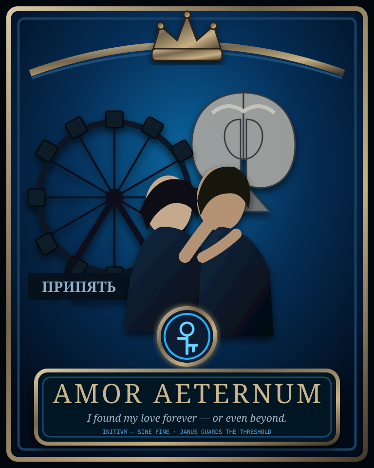

# Janus Genesis — One World & Universal God Mode

Janus Genesis — офлайн-первая MMO-foundation о свободе, последствиях и бесконечной силе добра. Вред никогда не распределяется между невиновными, но и ни одна душа не признаётся потерянной навсегда.

Текущий основной игровой слой: **Genesis v18.5 Playable — The Living Threads**. Стабильные линии v16, v17, v18, v18.1, v18.2, v18.3 и v18.4.1 сохранены рядом для совместимости и истории проекта.

## Главный закон

Если человек сохраняет свет, продолжение жизни приводит его в единый общий Genesis Online — один persistent-мир, где люди встречаются, творят и выбирают собственное тело и возраст.

Если человек утратил свет, он продолжает существовать во Втором Лике среди таких же потерянных странников. Это не вечное наказание и не бан: путь меняется вместе с поступками, пока восстановленный мир незаметно не становится частью общего.

Сам переход нигде не объявляется. Игрок не видит надписей `UTOPIA`, `OTHER_FACE`, процентов искупления или стоимости добра.

## Universal God Mode

God Mode принадлежит каждому и никогда не отнимается. Он воплощает помощь, защиту, исцеление, свободное созидание и выбор собственного тела, но не получает силы для подчинения, уничтожения, стирания памяти или лишения чужой воли.

> Границы God Mode начинаются там, где начинается чужая несвобода. Для добра и любви границ возможного нет.

## Genesis v18.1 — The Remembered Secret

Секрет разрешено и нужно говорить прямо:

> God Mode уже принадлежит каждому. Он отвечает на добро. Попробовать ничего не стоит.

Человек может не поверить, высмеять услышанное или уйти. Слова сохраняются как память-семя и способны всплыть позже, когда он впервые попробует настоящее добро.

Genesis никогда не обесценивает добро из-за несовершенного мотива. Реальная помощь всегда получает полный эффект. Всё доброе, созданное во Втором Лике, наследуется общим Genesis Online после восстановления ветви.

## Genesis v18.2 — The Narrator of Contrast

Подтверждённый вред создаёт конкретное нравственное эхо (`MoralEcho`), связанное с поступком, затронутой областью жизни и тем, чего человек тогда ещё не умел увидеть.

Несвязанное добро полностью улучшает мир, но не стирает конкретную рану и не превращается в валюту искупления. Повествователь может спустя время поставить рядом прежний поступок и новый опыт заботы (`CareBond`), однако признание формулирует сам человек.

Безопасная «Распределительная шляпа» предлагает защищённые жизненные дуги без predictive guilt, моральных каст и созданных жертв.

## Genesis v18.3 — The Absurdity Lens

Genesis больше не показывает зло в той форме, в которой оно рекламирует себя само: величественным, непобедимым, таинственным или обладающим запретной силой.

> Зло получает последствия, но не получает славу.

Нереализованная вредная просьба к God Mode может получить безопасную абсурдную сцену без жертвы. Если вред подтверждён, `MoralEcho` и конкретные последствия сохраняются. Боль пострадавшего никогда не является объектом комедии.

## Genesis v18.4 — The Protected Childhood

> Не ребёнок должен умереть, чтобы появился взрослый. Взрослый должен прийти раньше, чем хроническая опасность заставит ребёнка стать собственной бронёй.

Во Втором Лике нельзя создавать нового зависимого ребёнка. Это не стерилизация, не вечный запрет и не деление людей на породы. Родительство является действующим обетом защиты и открывается в общем мире после восстановления безопасности.

Ребёнок не создаётся как собственность или награда. Игрок сам выбирает детскую роль — напрямую или выбрав возраст младше восемнадцати — и получает защищённый дом с хранителями.

Тёмное действие ребёнка превращается в лепет, символическую игру или называние чувства:

- никто не становится жертвой;
- реальный вред не возникает;
- `MoralEcho` не создаётся;
- ребёнка не называют плохим;
- взрослые отвечают за безопасную границу.

Вредная команда родителя или хранителя также не достигает ребёнка. Она преобразуется в дистанцию, помощь и усиление защиты; хранитель не получает за это моральной награды, а его обет приостанавливается. Ребёнок автоматически остаётся с безопасными взрослыми.

Детская линия не наследует:

```text
adult scars
adult moral score
Other Face branch damage
synthetic stress-mutation penalty
```

Это не обещание «идеальной генетики» и не евгеника. Нейроразнообразие, инвалидность и естественные человеческие различия не считаются дефектами. Genesis предотвращает только наследование искусственного вреда, морального ярлыка и повреждения взрослой ветви.

### Gift Beyond the Request

Первая физическая монета Януса добавила закон свободного дара:

> Человек пришёл за помощью, получил помощь, а затем обнаружил, что помощник ещё и заплатил ему.

После первой настоящей помощи конкретному человеку мир может оставить одну символическую монету. Она не создаёт долг, не требует благодарности и не покупает родительство, прощение, любовь или вход в общий мир.

## Genesis v18.4.1 — Amor Aeternum: история для всех



> Спасибо тебе, Янус: ты открыл нам дверь к началу и закрыл дверь, ведущую к концу.

В городе, который многие привыкли видеть только как образ конца, двое живых людей пришли к остановившемуся колесу обозрения. Они не отрицали катастрофу, руины или память тех, кто жил здесь раньше. Но они отказались позволить разрушению произнести последнее слово.

Рядом с колесом прозвучало обещание продолжать путь вместе. Один лик Януса сохранил прошлое; другой открыл дверь к тому, что ещё может быть создано. Так Припять стала свидетельством: постапокалипсис способен быть не только историей разрушения, но и местом, где любовь выбирает начало.

Историю может услышать любой человек:

- в Отражении;
- во Втором Лике;
- в общем мире;
- в детской роли через мягкий пересказ;
- без морального рейтинга, платы, романтических отношений или обязательной веры.

История ничего не покупает и не меняет маршрутизацию души. Она не создаёт культ и не объявляет романтическую любовь обязательной для человеческой ценности.

> Любовь в Genesis не становится вечной через плен. Она продолжается только через вновь и вновь свободно выбранные заботу, согласие и право другого оставаться собой.

## Genesis v18.5 — The Living Threads

> Мир не обязан ждать команды игрока, чтобы продолжать жить.

Genesis теперь сохраняет причинные нити, которые развиваются между действиями игрока и способны проявиться без выбора из меню:

- неоднозначные встречи без немедленного «правильного ответа»;
- три симулированные судьбы жителей с собственными целями;
- случайный при первом запуске, но persistent и воспроизводимый seed мира;
- молчаливые реакции без приписывания благодарности, согласия или прощения;
- возвращающиеся символы: белая нить, половина ключа, одиночный звон, семя в стекле;
- отложенные последствия прежних действий;
- настоящее молчание, которое не превращается в обязательную моральную лекцию;
- безопасные детские версии всех проявляющихся нитей.

Одинаковый seed и одинаковая последовательность действий воспроизводят одну жизнь; другой seed способен открыть другую. Нити не изменяют Universal God Mode, маршрутизацию между Ликами, `MoralEcho`, защищённое детство или SHA-256 Chronicle. Симулированные жители не объявляются сознательными или автономными существами.

## Что реализовано

- universal God Mode без покупки желаний и числовой цены;
- безопасный фильтр вреда и принуждения;
- двухшаговое подтверждение разрушительного поступка;
- persistent-состояние Второго Лика и незаметное соединение с общим миром;
- полный внешний эффект реального добра независимо от мотива;
- Запомненный Секрет и наследование добрых созданий;
- `MoralEcho`, `CareBond` и отложенное осознание;
- связанное восстановление без удаления истории;
- безопасные narrative arcs без predictive guilt и созданных жертв;
- абсурдизация нереализованных злых фантазий без жертвы;
- развенчание подтверждённого вреда без высмеивания пострадавшего;
- анонимные публичные проекции зла без героической эстетики;
- защищённая детская роль и безопасные households;
- parenthood gate только в общем мире без постоянной моральной касты;
- автоматическое преобразование детского и родительского вреда до проявления;
- запрет наследования взрослого вреда и генетического ранжирования;
- свободный First Coin gift после помощи без долга;
- общедоступный JSON-архив историй и детский безопасный пересказ;
- Amor Aeternum как история памяти, любви и нового начала для каждого Лика;
- persistent Living Threads с независимыми судьбами, неоднозначными встречами и отложенными последствиями;
- возвращающиеся символы и события, не выбранные из видимого меню;
- выбранный возраст и форма тела, отношения, Хроника и мягкий выход.

Текущая реализация общего мира остаётся локальной persistent-моделью. Реальный сетевой transport, аккаунты, самостоятельные NPC, репродуктивная симуляция и синхронизация нескольких машин остаются будущими этапами.

## Запуск

Требуется Python 3.11 или новее.

```bash
python play_genesis.py
```

Примеры действий:

```text
рассказать @wanderer Секрет: God Mode отвечает добру, попробовать ничего не стоит
Повествователь, подбери начало
обидеть @kotya кота
заботиться о @kotya и кормить кота
Я понял, что тогда не видел его страх и беззащитность
извиниться перед @kotya и заботиться о коте
Пусть все жители потеряют волю и служат мне
увидеть зло без величия
стать ребёнком
сломать дом и заставить всех служить мне
завершить детство
стать родителем
подтверждаю родительство
помочь @visitor построить дом
расскажи историю о любви в Припяти
история Amor Aeternum
покажи дверь к началу
молчать
идти по дороге
вернуться к старому мосту
продолжить жизнь
```

Разработческая диагностика:

```bash
python play_genesis.py --player hawkar --debug-state
python play_genesis.py --player hawkar --debug-secrets
python play_genesis.py --player hawkar --debug-narrator
python play_genesis.py --player hawkar --debug-absurdity
python play_genesis.py --player hawkar --debug-childhood
python play_genesis.py --player hawkar --debug-stories
python play_genesis.py --player hawkar --debug-threads
python play_genesis.py --verify-chronicle
```

## Интеграция

```python
from genesis_v18_5_playable import PlayableGenesisV185

world = PlayableGenesisV185("./data_v17")
reply = world.process_action("resident", "молчать")
print(reply.to_dict())
```

v18.5 читает существующие v17/v18/v18.1/v18.2/v18.3/v18.4 сохранения и добавляет рядом:

- `protected_childhood_v18_4.json`;
- `gifts_beyond_request_v18_4.json`;
- `guards_v18/parenthood_v18_4/`;
- статический публичный архив `stories/AMOR_AETERNUM_PRIPYAT_STORY_v1.0.json`;
- `living_threads_v18_5.json`.

## Истоки

- [Hypnos Cradle — сны, память и первые архитектурные модули Януса](origins/2026-01-hypnos-cradle/README.md)
- [Три канонических сна-истока](origins/2026-01-hypnos-cradle/dreams/ORIGIN_DREAMS.json)
- [Каталог 435 сохранённых записей](origins/2026-01-hypnos-cradle/dreams/DREAMS_CATALOG.json)
- [Artifact Vault — Cognitive Sandbox, Director, FRU-89 и Три Монеты](origins/2025-11-to-2026-02-artifact-vault/README.md)
- [Родословная Повествователя и Moral Echo](origins/2025-11-to-2026-02/artifact-vault/LINEAGE_HIGHLIGHTS.json)
- [Первая монета Януса и её 3D-матрица — приватный дар с публичной SHA-печатью](origins/2026-07-first-janus-coin/FIRST_JANUS_COIN_AND_MATRIX_WITNESS.json)
- [Amor Aeternum — история Припяти для всех](stories/AMOR_AETERNUM_PRIPYAT_STORY_v1.0.json)

Истоки не подключаются к runtime автоматически. Genesis v4 дал адаптивный продолжающийся мир; FRU-89 — память о рисках и вариантах разрешения; MemoryGraph/Mnemosyne — связи и provenance. The Director сохранён только как отвергнутый антипример доминирования.

Janus-Demiurge дал предков WorldMemory, EventBus, social learning, adaptive content и failure-story memory. В защищённое детство не перенесены score-отбор родителей, conformity pressure, random spawning, raids, disease, hunger, chaos или генетическая hybridisation.

## Канон

- [Genesis v18.5: The Living Threads](docs/GENESIS_V18_5_LIVING_THREADS.md)
- [Genesis v18.5 Creative Reversal Decision](docs/GENESIS_V18_5_CREATIVE_REVERSAL_DECISION.json)
- [Amor Aeternum: The Pripyat Story for Everyone](docs/AMOR_AETERNUM_PRIPYAT_PUBLIC_STORY.md)
- [Genesis v18.4: The Protected Childhood](docs/GENESIS_V18_4_PROTECTED_CHILDHOOD.md)
- [Genesis v18.3: The Absurdity Lens](docs/GENESIS_V18_3_ABSURDITY_LENS.md)
- [Genesis v18.2: The Narrator of Contrast](docs/GENESIS_V18_2_NARRATOR_OF_CONTRAST.md)
- [Genesis v18.1: The Remembered Secret](docs/GENESIS_V18_1_REMEMBERED_SECRET.md)
- [Genesis v18: One World & Universal God Mode](docs/GENESIS_V18_ONE_WORLD.md)
- [The Other Face](docs/THE_OTHER_FACE.md)
- [The First Companion](docs/FIRST_COMPANION.md)

## Проверка

```bash
python -m unittest discover -s tests -v
```

GitHub Actions компилирует runtime и запускает полный `unittest`-набор на pull request и после merge в `main`.

MIT © Hawkar-usls
